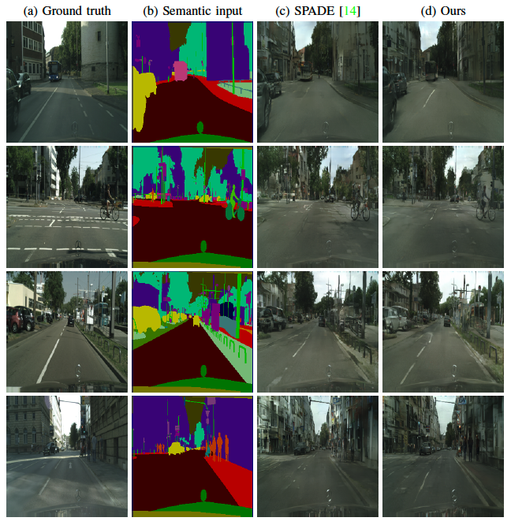

# A Shared Representation for Photorealistic Driving Simulators

The official code for the paper: "A Shared Representation for Photorealistic Driving Simulators"
, [paper](https://ieeexplore.ieee.org/abstract/document/9635715), [arXiv](https://arxiv.org/abs/2108.10879)

> __A Shared Representation for Photorealistic Driving Simulators__<br />
> _[Saeed Saadatnejad](https://scholar.google.com/citations?user=PBdhgFYAAAAJ&hl=en), [Siyuan Li](https://scholar.google.ch/citations?user=80_DZiwAAAAJ&hl=en), [Taylor Mordan](https://dblp.org/pid/203/8404.html), [Alexandre Alahi](https://scholar.google.com/citations?user=UIhXQ64AAAAJ&hl=en)_, 2021.
> A powerful simulator highly decreases the need for real-world tests when training and evaluating autonomous vehicles.
> Data-driven simulators flourished with the recent advancement of conditional Generative Adversarial Networks (cGANs), providing high-fidelity images.
> The main challenge is synthesizing photo-realistic images while following given constraints.
> In this work, we propose to improve the quality of generated images by rethinking the discriminator architecture.
> The focus is on the class of problems where images are generated given semantic inputs, such as scene segmentation maps or human body poses.
> We build on successful cGAN models to propose a new semantically-aware discriminator that better guides the generator.
> We aim to learn a shared latent representation that encodes enough information to jointly do semantic segmentation, content reconstruction, along with a coarse-to-fine grained adversarial reasoning.
> The achieved improvements are generic and simple enough to be applied to any architecture of conditional image synthesis.
> We demonstrate the strength of our method on the scene, building, and human synthesis tasks across three different datasets.
>

## Example

<p align="center">
  <a href="url"></a>
</p>  

## Getting Started

These instructions will get you a copy of the project up and running on your local machine for development and testing
purposes.

1. Clone this repo.

```
git clone https://github.com/vita-epfl/SemDisc.git
```

```
cd ./SemDisc
```

### Prerequisites

2. Please install dependencies by

```
pip install -r requirements.txt
```

### Dataset Preparation

3. The cityscapes dataset can be downloaded from
   here: [cityscapes](https://www.cityscapes-dataset.com/dataset-overview/)

For the experiment, you will need to download  [gtFine_trainvaltest.zip] and [leftImg8bit_trainvaltest.zip] and unzip
them.

## Training

After preparing all necessary environments and the dataset, activate your environment and start to train the network.

### Training with the semantic-aware discriminator

The training is doen in two steps. First, the network is trained without only the adversarial head of D:

```
python train.py --name spade_semdisc --dataset_mode cityscapes --netG spade --c2f_sem_rec --normalize_smaps \
--checkpoints_dir <checkpoints path> --dataroot <data path> \
--lambda_seg 1 --lambda_rec 1 --lambda_GAN 35 --lambda_feat 10 --lambda_vgg 10 --fine_grained_scale 0.05 \
--niter_decay 0 --niter 100 \
--aspect_ratio 1 --load_size 256 --crop_size 256 --batchSize 16 --gpu_ids 0
```

After the network is trained for some epochs, we finetune it with the complete D:

```
python train.py --name spade_semdisc --dataset_mode cityscapes --netG spade --c2f_sem_rec --normalize_smaps \
--checkpoints_dir <checkpoints path> --dataroot <data path> \
--lambda_seg 1 --lambda_rec 1 --lambda_GAN 35 --lambda_feat 10 --lambda_vgg 10 --fine_grained_scale 0.05 \
--niter_decay 100 --niter 100 --continue_train --active_GSeg \
--aspect_ratio 1 --load_size 256 --crop_size 256 --batchSize 16 --gpu_ids 0
```

You can change netG to different options [spade, asapnets, pix2pixhd].

### Training with original discriminator

The original model can be trained with the following command for comparison.

```
python train.py --name spade_orig --dataset_mode cityscapes --netG spade \
--checkpoints_dir <checkpoints path> --dataroot <data path> \
--niter_decay 100 --niter 100 --aspect_ratio 1 --load_size 256 --crop_size 256 --batchSize 16 --gpu_ids 0
```

Similarly, you can change netG to different options [spade, asapnets, pix2pixhd].

For now, only training on GPU is supported. In case of lack of space, try decreasing the batch size.

## Test

### Tests - image synthesis

After you have the trained networks, run the test as follows to get the synthesized images for both
original and semdisc models

```
python test.py --name $name --dataset_mode cityscapes \
--checkpoints_dir <checkpoints path> --dataroot <data path> --results_dir ./results/ \
--which_epoch latest --aspect_ratio 1 --load_size 256 --crop_size 256 \
--netG spade --how_many 496
```

### Tests - FID
For reporting FID scores, we leveraged [fid-pytorch](https://github.com/mseitzer/pytorch-fid).
To compute the score between two sets:
```
python fid/pytorch-fid/fid_score.py <GT_image path> <synthesized_image path> >> results/fid_$name.txt
```

### Tests - segmentation

For reporting the segmentation scores, we used [DRN](https://github.com/fyu/drn). The pre-trained model (and some other
details) can be found on this [page](https://github.com/NVlabs/SPADE/issues/39). Follow the instructions on the DRN
github page to setup Cityscapes.

You should have a main folder containing the drn/ folder (from github), the model .pth, the info.json, the
val_images.txt and val_labels.txt, a 'labels' folder with the *_trainIds.png images, and a 'synthesized_image' folder
with your *_leftImg8bit.png images.

The info.json is from the github, the val_images.txt and val_labels.txt can be obtained with the commands:

```
find labels/ -maxdepth 3 -name "*_trainIds.png" | sort > val_labels.txt
find synthesized_image/ -maxdepth 3 -name "*_leftImg8bit.png" | sort > val_images.txt
```

You also need to resize the label images to that size. You can do it with the convert command:

```
convert -sample 512X256\! "<Cityscapes val>/frankfurt/*_trainIds.png" -set filename:base "%[base]" "<path>/labels/%[filename:base].png"
convert -sample 512X256\! "<Cityscapes val>/lindau/*_trainIds.png" -set filename:base "%[base]" "<path>/labels/%[filename:base].png"
convert -sample 512X256\! "<Cityscapes val>/munster/*_trainIds.png" -set filename:base "%[base]" "<path>/labels/%[filename:base].png"
``` 

and the output of the models:

```
convert -sample 512X256\! "<Cityscapes test results path>/test_latest/images/synthesized_image/*.png" -set filename:base "%[base]" "synthesized_image/%[filename:base].png"
```

Then I run the model with:

``` 
cd drn/
python3 segment.py test -d ../ -c 19 --arch drn_d_105 --pretrained ../drn-d-105_ms_cityscapes.pth --phase val --batch-size 1 --ms >> ./results/seg_$name.txt
```

## Acknowledgments

The base of the code is borrowed from SPADE. Please refer to [SPADE](https://github.com/NVlabs/SPADE) to see the
details.

### Citation

```
@article{saadatnejad2021semdisc,
  author={Saadatnejad, Saeed and Li, Siyuan and Mordan, Taylor and Alahi, Alexandre},
  journal={IEEE Transactions on Intelligent Transportation Systems}, 
  title={A Shared Representation for Photorealistic Driving Simulators}, 
  year={2021},
  doi={10.1109/TITS.2021.3131303}
}
```
